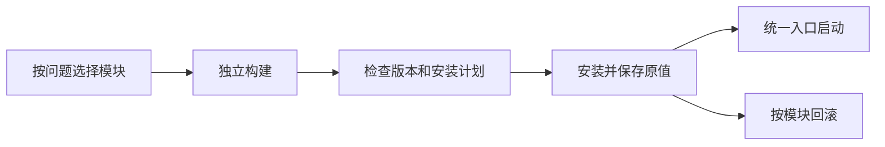

# 企业微信 Wine / Hyprland 修复工具集

用于解决 Windows 企业微信在 Linux Wine / Hyprland 环境中的
窗口显示、文档白屏、会议、摄像头、屏幕共享和图片粘贴问题。
各功能独立构建和安装，通过统一入口启动、检查和回滚。

## 目录

- [支持的环境](#支持的环境)
- [功能说明](#功能说明)
- [开始使用](#开始使用)
- [使用手册](#使用手册)
- [验证与限制](#验证与限制)

## 支持的环境

| 项目 | 验证范围 |
| --- | --- |
| 系统 | Arch Linux |
| 桌面 | Hyprland 0.56.2、XWayland |
| 企业微信 | Windows 版 5.0.11.6018 |
| 内置会议 | 3.26.511.637 |
| Wine | 11.17 / 11.18，具体模块以组件哈希为准 |
| 前缀 | 已安装企业微信的独立 Wine 前缀 |

脚本不包含企业微信安装器，需要已有可运行的企业微信安装。
不同版本和发行版的组件可能不同，哈希不匹配时会停止，不能强行套用。

## 功能说明

| 模块 | 解决的问题 | 详细说明 |
| --- | --- | --- |
| `display` | 装饰黑框、菜单输入、96 DPI 会议控件 | [窗口与 DPI][display] |
| `desktop` | 用 Thunar 打开文件夹、办公文件和链接转接 | [桌面集成][desktop] |
| `docs` | 共享文档白屏、文档宿主 DPI 不一致 | [文档修复][documents] |
| `meeting` | 内置会议入口缺失及并发运行库加载 | [会议依赖][meeting] |
| `camera` | Wine 11.17 摄像头格式枚举崩溃 | [摄像头修复][camera] |
| `screencast` | 内置会议读取不到完整 Wayland 桌面 | [屏幕共享][screencast] |
| `clipboard` | 双向图片粘贴、避免干扰 WPS 富格式 | [图片剪贴板][clipboard] |

没有默认安装全部功能的命令。请按问题选择模块，
特别是 `camera` 仅适用于已核验的 Wine 11.17 组件。

## 开始使用

先阅读[安装手册][install]并准备对应依赖。
下面以文档白屏修复为例，前缀路径请换成自己的实际路径。

```sh
git clone https://github.com/UsharbiSin/wecom-hyprland-fixes.git
cd wecom-hyprland-fixes
export WECOM_PREFIX="$HOME/.local/share/wecom/prefix"
./wecom-fix list
./wecom-fix build docs --prefix "$WECOM_PREFIX"
./wecom-fix install docs --prefix "$WECOM_PREFIX" --dry-run
```

确认计划后，正常退出该前缀内的全部 Wine 进程，再安装并启动：

```sh
./wecom-fix install docs --prefix "$WECOM_PREFIX"
./wecom-fix doctor --prefix "$WECOM_PREFIX"
./wecom-fix launch --prefix "$WECOM_PREFIX"
```

卸载单个模块时，同样先退出企业微信：

```sh
./wecom-fix remove docs --prefix "$WECOM_PREFIX"
```

原有启动器不会被改写，文件补丁需通过 `wecom-fix launch` 加载。
Hyprland 规则、MIME 默认程序和微软运行库有独立的操作步骤。

## 使用手册

- [依赖、构建、安装与日常使用][install]
- [回滚与旧方案迁移][rollback]
- [版本升级与故障排查](docs/usage/upgrade.md)
- [功能验证矩阵](docs/validation.md)
- [模块工作方式](docs/architecture.md)



## 验证与限制

文档白屏、窗口显示、96 DPI、Thunar、摄像头、共享和双向图片粘贴
均有对应环境的实际使用记录；各模块文档列出版本、检查方法及未验证范围。
安装后请按功能说明完成界面检查；自动检查不能替代实际使用验证。

Wine 11.18 不匹配旧摄像头补丁，脚本会拒绝混用内部 ABI。
屏幕共享不能自动排除会议自己的窗口，多显示器和不同缩放需单独测试。
使用旧全局图片转换服务的用户，请先阅读[剪贴板迁移说明][legacy]。

[display]: docs/features/display.md
[desktop]: docs/features/desktop.md
[documents]: docs/features/docs.md
[meeting]: docs/features/meeting.md
[camera]: docs/features/camera.md
[screencast]: docs/features/screencast.md
[clipboard]: docs/features/clipboard.md
[legacy]: docs/features/clipboard-legacy.md
[install]: docs/usage/install.md
[rollback]: docs/usage/rollback.md
