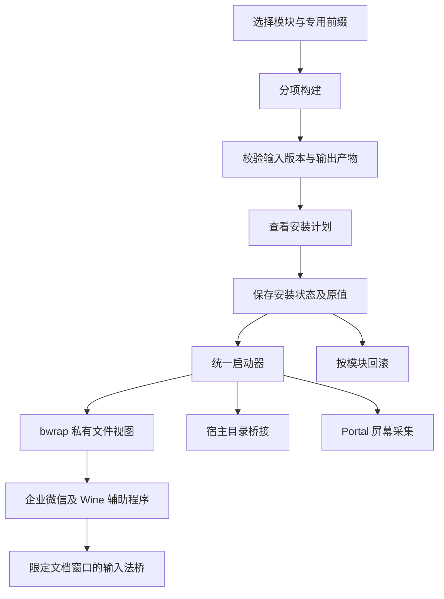

# 模块结构与运行方式

[返回首页](../README.md)

## 独立模块与统一入口

各项修复面向不同组件，版本要求和影响范围也不同。
可以单独选择需要的模块，分别构建、安装和回滚。
统一入口负责检查组件版本、保存原值，并加载已安装的修复。

桌面默认程序、Hyprland 规则和微软运行库有各自的设置步骤，
不会随着其他模块一起自动启用。

## 各类修复怎样生效

| 类型 | 生效方式 | 移除方式 |
| --- | --- | --- |
| DLL 与 Wine 后端兼容 | 启动时只读映射私有副本 | 移除模块后重启 |
| 窗口和剪贴板辅助程序 | 与企业微信会话一起运行 | 移除模块后不再启动 |
| 文档输入法桥 | 校验后向已核验线程加载桥接 DLL | 热停转交，退出会话释放 DLL |
| 前缀注册表设置 | 安装时保存原值并写入 | 按记录恢复原值 |
| 会议兼容入口 | 新增缺失 DLL，或备份已知旧兼容库后替换 | 移除新增文件或恢复备份 |
| 屏幕共享 | 当前企业微信进程树加载采集桥 | 移除模块后重启 |
| Hyprland 与桌面默认程序 | 按功能说明单独设置 | 按对应配置备份恢复 |
| CopyQ 历史预览 | 桌面自动命令仅补全企业微信新历史 | 只移除未修改的专用命令 |

`copyq` 是用户桌面级配置，不属于某个 Wine 前缀的启动会话。
安装、移除无需停止 Wine，`launch` 也不会要求 CopyQ 在线。
命令和备份位于独立的 `wecom-fixes/copyq/` 状态目录；
仅安装此模块时可运行不带 `--prefix` 的 `doctor`。
详细的原生命令保护和作用边界见 [CopyQ 历史预览](features/copyq.md)。

## 文档输入法跨进程转交

`docs-ime` 使用 Python 启动校验、会话辅助程序和 32 位桥接 DLL。
它与 `docs` 的 CEF 私有文件补丁分别管理，原版系统和应用文件不被覆盖。

Wine XIM 把输入更新保存在拥有顶层窗口的进程内。
桥接器只针对已核验的企业微信文档窗口，取出这一更新，
通过本地进程间消息送到真实获得焦点的网页线程。
接收线程再次检查归属，再调用公共 IMM 接口设置和完成文字输入。

候选位置沿相反方向传递：网页线程查询当前插入点，
把经过检查的屏幕坐标交给企业微信根窗口线程，由其更新所拥有的 XIM 连接。
位置更新不改写聊天框的组合窗口参数；焦点离开后停止应用该文档坐标。
协议和版本边界见[文档中文输入](features/docs-ime.md)。

辅助程序停止时等待目标线程清理；目标端也检查辅助程序是否仍然存活。
桥接 DLL 会驻留至网页进程退出，以保护隐藏消息窗口的回调。
因此“停止转交”和“卸载 DLL”是不同步骤，更新 DLL 后必须重启整个会话。
v2 对输入与坐标报文采用新的本地协议名称，会话互斥锁保持稳定；
已有辅助程序运行时，另一启动请求会明确失败，需先停用旧辅助程序。
原始预编辑光标和分句属性仍未完整恢复，不能据此泛化所有编辑场景。

## 会话与回滚状态

同一前缀不能同时安装、移除或启动另一会话。
已有 Wine 会话可能使用不同的文件视图，因此需要先正常退出。
统一入口会让企业微信和 Wine 辅助程序使用同一个 wineserver。
其他 Wine 前缀不受这些补丁和注册表设置影响。

输入和输出哈希、注册表原值及兼容库备份保存在安装状态目录。
卸载时需要这些数据，不要将该目录作为普通缓存清理。
源码更新或模块定义变化后，需要重新构建再安装。

bwrap 在这里用于提供私有文件视图，不限制企业微信访问其他宿主文件。
