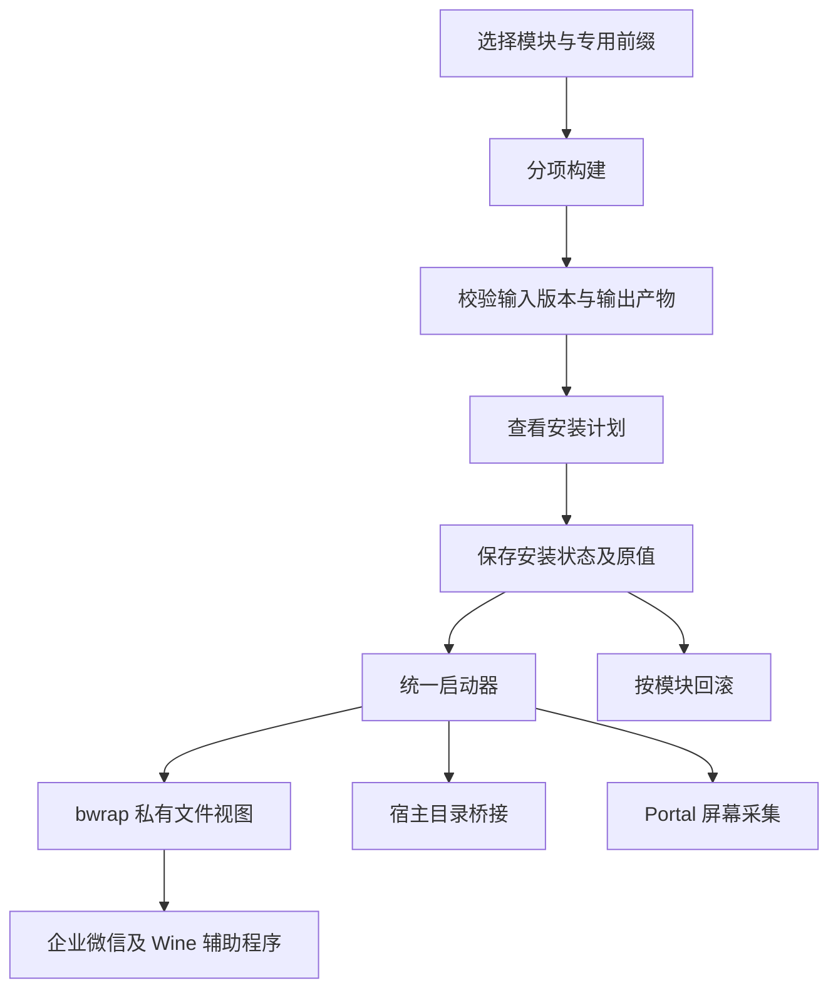

# 模块结构与运行方式

[返回首页](../README.md)

## 独立模块与统一入口

各项修复面向不同组件，版本要求和影响范围也不同。
可以单独选择需要的模块，分别构建、安装和回滚。
统一入口负责检查组件版本、保存原值，并加载已安装的修复。

桌面默认程序、Hyprland 规则和微软运行库有各自的设置步骤，
不会随着其他模块一起自动启用。

## 各类修复怎样生效

| 类型 | 生效方式 | 移除方式 |
| --- | --- | --- |
| DLL 与 Wine 后端兼容 | 启动时只读映射私有副本 | 移除模块后重启 |
| 窗口和剪贴板辅助程序 | 与企业微信会话一起运行 | 移除模块后不再启动 |
| 前缀注册表设置 | 安装时保存原值并写入 | 按记录恢复原值 |
| 会议兼容入口 | 新增缺失 DLL，或备份已知旧兼容库后替换 | 移除新增文件或恢复备份 |
| 屏幕共享 | 当前企业微信进程树加载采集桥 | 移除模块后重启 |
| Hyprland 与桌面默认程序 | 按功能说明单独设置 | 按对应配置备份恢复 |

## 会话与回滚状态

同一前缀不能同时安装、移除或启动另一会话。
已有 Wine 会话可能使用不同的文件视图，因此需要先正常退出。
统一入口会让企业微信和 Wine 辅助程序使用同一个 wineserver。
其他 Wine 前缀不受这些补丁和注册表设置影响。

输入和输出哈希、注册表原值及兼容库备份保存在安装状态目录。
卸载时需要这些数据，不要将该目录作为普通缓存清理。
源码更新或模块定义变化后，需要重新构建再安装。

bwrap 在这里用于提供私有文件视图，不限制企业微信访问其他宿主文件。
