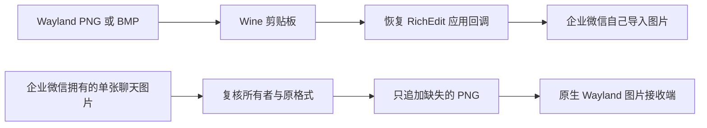

# 双向图片剪贴板

[返回总览](../../README.md) · [旧服务迁移](clipboard-legacy.md)

## 目录

- [解决的问题](#解决的问题)
- [两个方向怎样工作](#两个方向怎样工作)
- [依赖与版本范围](#依赖与版本范围)
- [构建与安装](#构建与安装)
- [验收与已验证范围](#验收与已验证范围)
- [回滚](#回滚)
- [常见问题与限制](#常见问题与限制)
- [上游接口与许可](#上游接口与许可)

## 解决的问题

该模块处理 Wine 企业微信与原生 Wayland 应用之间的图片复制粘贴：

1. 外部已有 PNG/BMP，企业微信聊天输入框却无法直接显示图片。
2. 企业微信复制的聊天图片包含应用私有格式和文件路径，
   原生 Wayland 图片接收端缺少可用的 PNG 格式。
3. 旧全局转换服务会重新发布剪贴板，与 WPS 富格式复制、格式刷冲突。

固定前缀版本于 2026-09-27 通过双向图片粘贴和 WPS 表格界面验收，
并于 2026-10-08 在 Wine 11.19 重测 PNG/BMP 输入及双向图片粘贴。
当前可配置前缀版本已通过构建与离线保护检查，尚未完成真实桌面复测。
安装后请按下方步骤确认自己的桌面环境和应用组合。

## 两个方向怎样工作



### 输入：恢复应用回调

已核对的 Wine 11.18、11.19 的 `paste_special` 获取数据后没有调用应用注册的
`IRichEditOleCallback::QueryAcceptData`。
该路径缺失使企业微信自己的图片导入代码没有机会处理数据。

补丁恢复此回调。`S_OK` 继续原有格式处理；失败码拒绝粘贴；
其他成功码表示应用已经检查或导入，复用原来的数据对象释放路径。
`CLIPFORMAT*` 允许应用选择格式。[微软 RichEdit OLE 接口目录][callback]

生成的 DLL 通过 `bwrap` 映射到统一入口启动的企业微信进程视图。
主机 Wine 文件及专用前缀原 DLL 保持原样，其他 Wine 前缀不受影响。
该模块恢复应用回调，不实现通用的 RichEdit 图片插入器。

### 输出：仅追加企业微信图片的 PNG

输出辅助程序必须同时确认以下条件：

1. `WINEPREFIX` 与构建时固定的专用前缀完全一致。
2. 剪贴板所有者是存活的企业微信进程，完整程序路径精确匹配。
3. 包含 `WeWork Message`、`CF_HDROP`，且文件列表只有一项。
4. 完全没有 `PNG` 格式；已有但为空或延迟渲染的 PNG 也不覆盖。
5. 文件是盘符绝对路径，可解码为大小受限的图片。
6. 解码后再次锁定，窗口、进程、序号、文件路径、原格式集合均未变化。

唯一写调用是向原剪贴板增加 `PNG`。
没有 `EmptyClipboard`、`OleSetClipboard`、`OleFlushClipboard` 调用。
写后再次检查所有者和全部原格式存在；失败则停止，不用另一次写入回滚。

程序单实例运行，绑定企业微信主窗口对应进程，进程退出后结束。
启动后 60 秒未找到企业微信也会退出，不建立新的全局用户服务。
定时器创建失败时立即进入退出流程，避免辅助程序无限等待。

## 依赖与版本范围

| 项目 | 已验证基线 |
| --- | --- |
| 系统与桌面 | Arch Linux、Hyprland、XWayland |
| Wine | 11.18-1、11.19-1，i386 RichEdit 文件需精确匹配 |
| 企业微信 | 5.0.11.6018，默认 `C:` 安装目录 |
| 构建工具 | Python 3、binutils、GCC/G++、MinGW-w64 G++ |
| 运行工具 | Wine、bubblewrap；可正常运行的专用 Wine 前缀 |

Wine 11.18-1 原始 DLL 的 SHA-256：

```text
18117302c2dbc043e0b35aea4f6e40120dd95ffe2eb5720a80f0d7f522eb0cc3
```

Wine 11.18-1 补丁副本的 SHA-256：

```text
bbd98cd94d20d6858f99c7f5d5228bd76317b86dc0879e3f8f09780f4c7dfb12
```

Wine 11.19-1 原始 DLL 的 SHA-256：

```text
3b903f943ca5f65215d78fedaf30260b8e7ce8bb7626325a4c21db0f57a40295
```

Wine 11.19-1 补丁副本的 SHA-256：

```text
4f8a275302cfc4cfbbf739d91615805fde85dda22b4bfaaae5f7ce40595f593a
```

构建器按原始文件的完整哈希选择版本，再检查关键指令和输出哈希。
11.19 适配依据本机 DLL 的反汇编，以及与 11.18 完整粘贴函数的字节比对；
回调偏移、相关导入和节布局一致，沿用同一份回调机器码。
安装时核对系统、前缀原文件和补丁副本的版本配对，拒绝新旧版本混用。
启动时再次检查安装记录中的原始文件及产物哈希。
相同版本号并不能替代哈希；不同发行版构建也可能不兼容。

## 构建与安装

在仓库根目录运行。把变量改为自己现有的企业微信专用 Wine 前缀：

```bash
wecom_prefix="$HOME/.local/share/wecom-hyprland/prefix-dpi96-trial"
./wecom-fix build clipboard --prefix "$wecom_prefix"
```

构建不启动 Wine，不访问真实剪贴板，也不会自动下载软件。
输入补丁会执行两个加载地址各 18 项机器码测试；
输出程序会执行纯策略测试，并检查编译后的 API 导入。
产物保存在 `build/clipboard/`。

退出该前缀内全部企业微信进程后安装：

```bash
./wecom-fix install clipboard --prefix "$wecom_prefix"
./wecom-fix doctor --prefix "$wecom_prefix"
./wecom-fix launch --prefix "$wecom_prefix"
```

构建与安装必须使用同一个前缀。
如果迁移前缀目录，重新构建、安装；不要直接复制旧辅助程序。
已有其他修复时，先阅读[回滚与旧部署迁移](../usage/rollback.md)。

若以前启用了全局 `wecom-clipboard.service`，先停止该旧服务，
并移除旧启动器中显式启动它的命令。新模块不会替用户重写旧启动器。
迁移详情见[旧服务迁移](clipboard-legacy.md)。

## 验收与已验证范围

### 界面验证：2026-09-27 固定前缀版本

以下结果适用于 Wine 11.18-1、上述企业微信和桌面基线。
更换版本、前缀或剪贴板管理器后，需要重新验收。

| 场景 | 记录结果 |
| --- | --- |
| 纯 PNG → 企业微信 | 320×180 图在聊天草稿显示；正常启动器重启后复测通过 |
| 纯 BMP → 企业微信 | 在聊天草稿直接显示图片 |
| 企业微信 → 原生 Wayland GTK | 实际显示 551×178 图，后端为 `GdkWaylandDisplay` |
| 企业微信 → 企业微信 | 图片直接显示，原应用格式保留 |
| 中英文文本双向复制 | 通过；企微复制文字保留 RichEdit 原有末尾换行 |
| WPS 区域复制 | A1:B2 → D1:E2 内容、字体、填色保留 |
| WPS 公式平移 | `B1*2` 正确变为 `E1*2` |
| WPS 格式刷 | A1 → D5 通过；切换到企业微信再返回后仍可用 |
| WPS 私有格式集合 | 辅助程序运行时，等待和切换焦点后保持不变 |

WPS 结果限于表格复制及格式刷，不覆盖其他 WPS 模块。
图片接收测试需要支持图片的应用，纯文本输入框不属于验收目标。

### 离线验证：2026-09-28 可配置前缀版本

| 检查 | 结果 |
| --- | --- |
| RichEdit 重建 | 与 2026-09-27 已验收补丁的 SHA-256 完全一致 |
| 完整粘贴机器码 | 两个加载地址各 14 项通过 |
| 输出保护策略 | 前缀、路径、格式集合、大小边界离线测试通过 |
| 构建配置转义 | 中文、空格、引号、反斜杠、非 BMP 字符路径通过 |
| 未知 DLL | 正常和 Python 优化模式均拒绝；不生成输出目录 |
| 输出程序 | MinGW 严格警告编译通过，无清空或接管剪贴板 API 导入 |
| 当前版本界面 | 尚未完成真实桌面复测；安装后需要人工验收 |

输出程序在构建时固定前缀，不同前缀生成的 exe 哈希可能不同。
离线检查不包含实际应用中的图片显示，不能替代界面验收。

### Wine 11.19 验证：2026-10-08

Wine 11.19-1、企业微信 5.0.11.6018、Arch Linux / Hyprland / XWayland：

| 检查 | 结果 |
| --- | --- |
| 当前原 DLL 重建 | 与已部署的 11.19 固定前缀补丁完整哈希一致 |
| 完整粘贴机器码 | 11.18 和 11.19 均在两个加载地址各 18 项通过 |
| 失败分支 | 获取剪贴板失败不调用回调；取数据失败仍恰好释放一次 |
| 固定前缀 PNG/BMP 输入 | 两种图片均在企业微信聊天草稿实际显示 |
| 固定前缀双向图片 | 内部粘贴通过；原生 Wayland 接收端显示 1895×1055 图 |
| 测试消息与草稿 | 未发送消息，测试草稿已清空 |
| 当前可配置前缀入口 | 构建与离线检查通过，未完成统一入口界面复测 |

本次未重测 WPS 表格，也未重新核对 11.19 上游源码。
固定前缀的部署验收不能代替本仓库可配置前缀辅助程序的界面验收。
未知原文件、已修补文件、截断文件和非代码区损坏均被完整哈希门禁拒绝。

### 安装后的人工验收步骤

1. 用测试图片从原生 Wayland 应用复制。
2. 在自己的企微草稿内粘贴，确认看到图片，分别检查 PNG 与 BMP。
3. 从自己可使用的聊天图片复制，到支持图片的原生 Wayland 应用粘贴。
4. 再做企微内部图片粘贴和中英文文本双向复制。
5. 用临时 WPS 表格检查区域复制、公式平移与格式刷，包含跨应用切换。
6. 清空测试草稿；退出再用统一入口启动后重复关键检查。

## 回滚

退出该 Wine 前缀内的企业微信后执行：

```bash
./wecom-fix remove clipboard --prefix "$wecom_prefix"
./wecom-fix launch --prefix "$wecom_prefix"
```

移除本模块后，启动器不再映射 RichEdit 副本，也不再启动输出辅助程序。
原始 DLL 未被覆盖，因此无需复制备份到系统目录。
回滚不重新开启旧的全局剪贴板服务。

## 常见问题与限制

**提示哈希不匹配。** Wine 或前缀文件与基线不同。
本工具会拒绝加载不匹配模块。先确认组件版本与前缀路径，
升级 Wine 后可移除此模块，重新检查原版组件是否仍存在粘贴问题。

**输出图片没有新增 PNG。** 辅助程序有意跳过多文件、未知所有者、
没有企业微信私有标记、已有 PNG、来源变化或无法解码的内容。
文件及编码输出不得超过 64 MiB，像素总数不得超过 1600 万，
单边不得超过 16384 像素。

**进程存在但不处理。** 程序路径或主窗口类可能随企业微信版本改变。
当前要求 `C:\Program Files (x86)\WXWork\WXWork.exe` 与 `WeWorkWindow`。
非默认安装路径需经验证后调整源码，不能简单取消来源检查。

**与其他剪贴板管理器共用。** 本程序核对所有者和格式集合，
不读取或重序列化 OLE 私有对象，验证范围未覆盖其内部状态。
外部管理器在新格式出现后的行为也不由该模块控制。
新增 PNG 会改变序号，应在自己的完整桌面组合中验收。

**路径与解码边界。** UNC 和相对路径被拒绝；Wine 盘符映射仍由前缀配置决定，
不代表盘符背后的文件系统必然是本地磁盘。
大小限制不能替代 GDI+ 解码器本身的安全维护。

## 上游接口与许可

输入兼容处理基于 [Wine 11.18 RichEdit 源码][wine] 和
[微软 RichEdit OLE 接口][callback]。
源码补丁的许可见 [RichEdit 许可说明][license]。

标准构建从本地匹配版本的 DLL 生成补丁副本。

[license]: ../../modules/clipboard/riched20/LICENSE.md

[wine]: https://github.com/wine-mirror/wine/tree/wine-11.18/dlls/riched20
[callback]: https://learn.microsoft.com/windows/win32/api/richole
