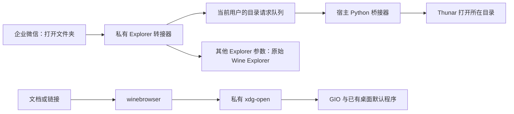

# Thunar、办公文档与桌面打开入口

[返回首页](../../README.md) · [使用说明](../usage/README.md)

## 解决的问题

企业微信“打开文件夹”通常调用 Wine 的
`explorer.exe /select, C:\...\文件名`，不直接使用 Linux 目录默认程序。
因此，仅将 `inode/directory` 改成 Thunar，不能覆盖这个入口。

Wine 的 `winebrowser` 在 Hyprland 环境中可能走入终端浏览器分支，
或者传出 `file://home\用户\目录` 这样的异常 URI。
模块通过私有 `xdg-open` 将请求交给 GIO 和已有桌面默认程序。

## 工作流程



`/select,` 的文件路径转为所在目录；不会执行文件，也不会自动选中文件。
本地盘符的目录支持中文和空格。网络共享及其他 Explorer 参数回退原程序。

模块通过 Bubblewrap 将转接器只读绑定到三个 Explorer 入口。
原始前缀文件保持原样；卸载或离开私有进程视图后，仍可读取原文件。

这三个绑定没有固定版本的补丁哈希，因为转接器是独立程序，
不是按字节修改上游 Explorer。安装时记录每个目标的当前哈希，
启动时再次检查；Wine 更新导致目标改变时需要重新核对并安装。
它保证“目标没有在安装后变化”，不代表所有 Wine 版本都已兼容验证。

## 依赖与构建

需要 Python 3、Thunar、GIO、Bubblewrap、Wine，以及
`i686-w64-mingw32-gcc` 和 `x86_64-w64-mingw32-gcc`。

模块按 Arch Linux 的 Wine 布局寻找原始程序：

- `/usr/lib/wine/i386-windows/explorer.exe`
- `/usr/lib/wine/x86_64-windows/explorer.exe`

其他发行版需修改模块中的路径并重新验证，不要盲目创建兼容符号链接。

```bash
PREFIX="$HOME/.local/share/wecom/prefix"
./wecom-fix build desktop --prefix "$PREFIX"
```

## 安装和启动

先正常退出专用前缀内的 Wine 程序，再执行：

```bash
./wecom-fix install desktop --prefix "$PREFIX"
./wecom-fix launch --prefix "$PREFIX"
```

管理器保存并设置该前缀的 `explorer.exe=native` DLL 覆盖，
同时启动宿主桥接器、绑定三个 Explorer 入口并加入私有 `bin` 到 `PATH`。
这个模块本身不改 Linux 全局或用户的 MIME 默认程序。

队列位于当前前缀对应的私有安装状态目录，目录权限为 `0700`，
队列为当前用户所有的 `0600` 常规文件；拒绝符号链接和硬链接。
请求只作为绝对目录传给 `thunar`，不通过 shell 执行。

每条记录限制 32 KiB，队列约 8 MiB 后停止接收并回退原 Explorer。
遇到队列损坏或过大，先退出企业微信和桥接器，再删除状态目录中的
`thunar-queue`；下次启动会重新创建。不要删除整个状态目录，
其中保存模块卸载所需的备份。

## 可选：设置 Thunar、WPS 和原生腾讯会议为默认程序

该操作影响其他应用，故提供单独的显式命令；默认只打印计划：

```bash
python3 modules/desktop/mime-defaults.py
```

确认计划中列出的程序已安装后，显式应用并保留备份：

```bash
BACKUP="$HOME/.local/state/wecom-mime-backup"
python3 modules/desktop/mime-defaults.py \
  --apply --backup-dir "$BACKUP"
```

默认设置目录、Word、Excel、PowerPoint 和 PDF 的 8 项常见 MIME。
脚本保留其他 MIME 关联，包括网页浏览器默认程序。
如需将 `wemeet:` 链接交给原生腾讯会议，在计划和应用时加 `--meeting`。
前提是 `wemeetapp.desktop` 已存在。

恢复命令为：

```bash
python3 modules/desktop/mime-defaults.py \
  --restore --backup-dir "$BACKUP"
```

恢复前检查当前配置与应用后哈希一致。如果你后来又修改了默认程序，
脚本会拒绝整体覆盖，需要对照备份手动合并。

## 可选：让 Wine 办公文档关联进入桌面处理器

现有前缀已经有正常的办公文件关联时，无需重复做这一节。
`office.reg` 和 `async_open.vbs` 提供以下关联：
七类办公扩展名交给 `wscript`，异步调用 `winebrowser`，再交给 GIO。

这一步修改专用前缀的用户注册表，模板采用
`HKCU\Software\Classes`，不会写宿主机的注册表或 MIME 文件。
先退出企业微信并保存完整前缀快照，再进行下列显式操作：

```bash
cp modules/desktop/async_open.vbs "$PREFIX/drive_c/windows/"
WINEPREFIX="$PREFIX" wine reg import modules/desktop/office.reg
```

若目标已有 `async_open.vbs`，先比较并备份，勿直接覆盖未知脚本。
导入前保存的前缀快照是这一可选手动步骤的恢复依据；
`wecom-fix remove desktop` 不会撤销你手动导入的关联。

`wemeet:` 需要同样通过 Wine `winebrowser.exe "%1"` 转接，
再由宿主的 `x-scheme-handler/wemeet` 选择原生会议程序。
是否应转接到原生会议取决于你的工作流，不会自动替代内嵌会议。

## 验证方法与边界

1. 在临时目录内创建带中文和空格的测试文件。
2. 在企业微信的文件菜单使用“打开文件夹”，检查 Thunar 地址栏。
3. 对另一位置的文件再试一次，确认没有重放旧请求。
4. 打开一份自己创建的 Word 或 PDF，确认交给预期的 WPS 应用。
5. 打开普通网页，确认仍遵循已有浏览器默认程序。
6. 正常退出企业微信，确认桥接器被管理器结束。

2026-09-21，在 Arch Linux、Hyprland 0.56.2、Wine 11.17、
企业微信 5.0.11.6018 环境中，直接安装到 Wine 前缀的 Explorer 转接器
已有实际文件菜单验证：Thunar 打开正确目录，Word、PDF 仍使用 WPS。
这一验证结果不覆盖本模块的 Bubblewrap 文件绑定方式。

2026-09-28，Arch Linux、Wine 11.18 环境下的 32/64 位编译通过；
中文空格路径解析、不完整请求重试、异常队列拒绝和 URI 规范化测试通过。
Bubblewrap 文件绑定及原始 Explorer 回退尚未完成端到端桌面验证。

## 回滚模块

```bash
./wecom-fix remove desktop --prefix "$PREFIX"
```

先正常退出企业微信再执行。管理器撤销本模块安装状态并恢复原 DLL 覆盖值。
由于文件绑定只存在于启动进程视图，不需要往前缀复制回旧 Explorer。
可选的 MIME 默认程序另按本页恢复命令回滚。
