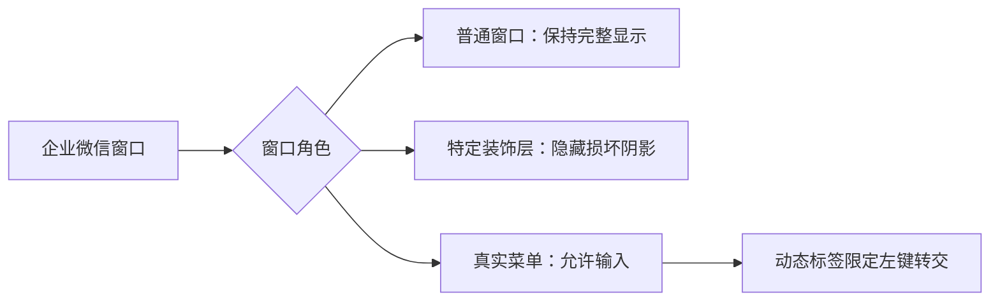

# 窗口、菜单与 96 DPI

[返回首页](../../README.md) · [使用说明](../usage/README.md)

## 解决的问题

企业微信以 Wine/XWayland 运行时，装饰阴影可能成为黑框，
会议共享的边框可能遮住画面，右键菜单超出主窗口后可能无法点击。
模块按普通窗口、装饰层、真实菜单分别设置显示和输入行为。

另一个问题是较高 Wine DPI 下的内嵌会议布局与共享控件异常。
模块将专用前缀设为 96 DPI；聊天文字大小通过企业微信自己的设置调节。
这会影响同一 Wine 前缀内的其他程序，因此必须使用专用前缀。

## 模块由什么组成

| 文件 | 作用 |
| --- | --- |
| `shadow-guard.c` | 识别并隐藏特定装饰层 |
| `hyprland.lua` | 按窗口角色设置焦点、透明度和点击转交 |
| `module.json` | 记录两处 96 DPI 注册表设置及辅助进程 |
| `build.sh` | 从源码构建 32 位辅助程序 |

辅助程序仅处理满足条件的窗口：

- `PerryShadowWnd`：进程必须为 `WXWork.exe`，且所有者属于同一进程。
- `screen_share_tracker`：窗口类必须为 `Qt5158QWindowIcon`，
  具有分层、鼠标穿透和工具窗口样式；进程必须为
  `WXWork/WeMeet` 路径下的 `wwmapp.exe`。

会议功能工具栏不符合这些条件，不会被隐藏。
辅助程序监听窗口显示事件；找到企业微信后跟随其进程寿命退出。
若 60 秒内没有找到目标装饰层，则自行退出，不无限保留 Wine 会话。



Hyprland 片段给精确匹配企业微信 class 和 `menu` 标题的窗口打标签，
再把左键转交给该标签，避免匹配其他应用中同名的菜单窗口。
动态标签和规则语义参见 [Hyprland 官方窗口规则][rules]。

[rules]: https://wiki.hypr.land/Configuring/Window-Rules/

## 依赖与构建

需要 Wine、`i686-w64-mingw32-gcc`；配置片段面向
Hyprland 0.56.2 的 Lua 接口。旧式 `.conf` 配置不能直接加载该文件。

在仓库根目录执行，路径替换为自己的专用前缀：

```bash
PREFIX="$HOME/.local/share/wecom/prefix"
./wecom-fix build display --prefix "$PREFIX"
```

构建只向仓库 `build/display/` 写入产物，
不接触正在运行的企业微信，也不改变当前桌面配置。

## 安装与使用

先正常退出这个前缀内的企业微信及其他 Wine 程序，再安装：

```bash
./wecom-fix install display --prefix "$PREFIX"
./wecom-fix launch --prefix "$PREFIX"
```

安装器保存原值后写入：

- `HKCU\Control Panel\Desktop` 下的 `LogPixels=96`。
- `HKCC\Software\Fonts` 下的 `LogPixels=96`。

安装不会自动改写你的 Hyprland 主配置。将本仓库片段的绝对路径
加入 `~/.config/hypr/hyprland.lua`，例如：

```lua
dofile(os.getenv("HOME") .. "/src/wecom-fixes/modules/display/hyprland.lua")
```

这个例子假定你将仓库放在 `~/src/wecom-fixes`，请按实际位置改写。
先移除旧的企业微信规则和只按标题匹配的左键绑定，避免规则互相覆盖。
只删除企业微信对应段落，保留自己的其他桌面规则。

```bash
luac -p "$HOME/.config/hypr/hyprland.lua"
hyprctl reload config-only
hyprctl configerrors
```

聊天字体可在企业微信“设置 → 通用 → 字体大小”中调大。
建议保留 96 DPI；整体提高 Wine DPI 可能使会议布局问题再次出现。

## 怎么确认生效

1. 主窗口可正常点击、输入和移动；没有额外黑框。
2. 在会话列表和消息上分别打开菜单，等待、悬停后菜单仍在。
3. 移动主窗口，让菜单超出主窗口边缘，点击“另存为”后取消。
4. 点击菜单外部，确认关闭菜单且普通左键行为正常。
5. 实际进入内嵌会议，检查控件位置和共享工具栏；共享边框不遮挡画面。
6. 企业微信退出后，确认对应 `shadow-guard.exe` 随后退出。

## 已验证环境与限制

2026-09-21，在 Arch Linux、Hyprland 0.56.2、Wine 11.17、
企业微信 5.0.11.6018 环境中，菜单超出主窗口后的“另存为”操作
有实际界面验证记录；96 DPI 下的会议控件与共享表现有使用确认记录。
这些记录对应 `wxwork-menu-input` 焦点规则和装饰层辅助程序。

2026-09-28，Arch Linux、Wine 11.18 环境下的 C 编译和 Lua 语法检查通过。
本模块的动态标签点击转交规则尚未完成实际菜单交互验证。
会议装饰层识别依据企业微信 5.0.11.6018 的窗口类名和进程路径，
升级企业微信后需要重新检查。

使用时还应注意：

- 本模块不需要旧的 `menu-zorder-guard` 轮询程序，请勿同时启用。
- 不要将真实菜单统一设为 `no_focus=true`，否则窗口外的菜单项可能无法点击。
- 不要启用 `opaque` 或 `force_rgbx`，它们会破坏装饰层自己的透明通道。
- 单击偶发打开独立窗口的原因尚未确定；重启后恢复不代表根因已消除。

## 回滚

正常退出企业微信后执行：

```bash
./wecom-fix remove display --prefix "$PREFIX"
```

管理器按安装记录恢复 DPI 原值。再移除自己加入的 `dofile(...)`，
恢复安装前的企业微信窗口规则并重新加载 Hyprland。
卸载模块不会擅自修改用户的 Hyprland 文件。
