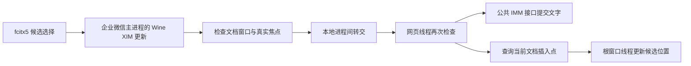

# 共享文档的 fcitx5 中文输入与候选定位

[返回总览](../../README.md) · [安装说明](../usage/install.md) ·
[文档白屏修复](docs.md)

## 适用症状与环境

文档已经能打开，英文也能输入；fcitx5 可以显示拼音候选，
但按空格选字后中文没有进入文档输入框，候选还可能位于旧聊天框附近。
本模块处理已核验环境中的跨进程输入转交与候选坐标更新。
文档本身空白时，请先检查独立的 `docs` 模块。

| 项目 | 本次实际验证 |
| --- | --- |
| 系统 | Arch Linux |
| Wine | `11.18-1`，按模块清单核对组件 SHA-256 |
| 企业微信 | Windows 版 `5.0.11.6018` |
| 桌面 | Hyprland `0.56.2`、XWayland |
| 显示条件 | 单显示器、Wine 96 DPI、桌面 125% 缩放 |
| 输入法 | Fcitx5 `5.1.23`，Rime |
| 实际输入位置 | 共享文档中未发送的评论草稿 |

同一个版本号不保证文件字节相同。其他 Wine 构建、企业微信版本，
以及表格和正文编辑等场景，没有包含在上述界面验证中。

## 故障定位

该文档窗口由三个进程共同组成：企业微信提供外层窗口，
`WeMail.exe` 提供文档宿主，`WXWorkWeb.exe` 提供网页输入框。
点击评论草稿后，真实输入焦点已经进入网页子窗口。

现场检查确认：fcitx5 的候选选择能够到达企业微信主进程，
而拥有输入焦点的网页进程没有收到相应的输入法合成消息。
因此，设置输入法环境变量或重新点击输入框不能解释并解决这一故障。

Wine `11.18` 的 XIM 实现把预编辑和已选中的文字保存在当前进程内，
再把一个更新编号交给顶层窗口所在线程的默认输入法窗口。
编号对应的数据不会自动进入另一个进程中的网页输入框。
相关实现见 [XIM 更新][xim]、[更新队列][imm]和[内部消息转交][message]。

外部检查程序调用 `ImmGetContext` 得到空值，不能单独证明网页没有
输入法上下文：Wine 本身限制跨进程读取这一对象。
本次诊断是在相应进程内检查上下文，并结合真实输入对照确认的。

## 模块怎样工作

`docs-ime` 独立于白屏修复；它不修改企业微信原始 DLL 或系统 Wine 库。
模块包含一个会话辅助程序和一个限定窗口范围的输入转交 DLL。

1. 每次构建、启动前，检查系统 Wine 库、前缀中的 Wine DLL，
   以及企业微信、网页宿主和文档宿主程序的 SHA-256。
2. 查找已核验路径下的企业微信窗口，并核对网页窗口的完整父窗口链。
3. 在源进程中取出待处理的 Wine XIM 更新，把文字通过本地进程间消息
   交给实际获得焦点的网页线程。
4. 接收线程再次核对焦点、进程路径与窗口归属，使用公共 IMM 接口
   设置预编辑文字，并完成已选中文字的提交。
5. 网页线程查询当前插入点，将屏幕坐标传回企业微信根窗口所属线程，
   由该线程更新 Wine XIM 的候选位置。



主进程与目标进程相同、窗口链不匹配或接收时焦点已经改变时，
不会把该更新交给另一个输入框。普通聊天输入不属于目标窗口范围。
已取出的更新若在最后转交时失败，可能丢失该次输入；
模块不会把它补写到旧聊天框。

源端取数据使用 Wine `11.18` 的私有接口，所以版本门禁必须保留。
目标端采用公共 IMM 接口，避开当前 32 位兼容层不支持的私有写入调用；
相关限制见 [WOW64 参数转换][wow64]。
具体哈希以 [模块清单](../../modules/docs-ime/module.json) 为准。

### 候选位置为什么需要反向传递

文字转交成功不代表候选位置也会更新。Wine 的 `ImmSetCandidateWindow`
只保存候选框参数；更新 XIM 插入点的是另一条组合窗口定位路径。
文档网页进程不拥有外层企业微信窗口的 XIM 连接，不能直接更新它。

网页线程通过 `WM_IME_REQUEST / IMR_QUERYCHARPOSITION` 查询真实插入点。
Chromium 的该接口返回屏幕像素和行高；没有组合文字时返回光标位置，
有组合文字时返回首字位置。查询在网页线程本地完成，避免跨进程传指针。
实现来源见 [Chromium 输入法源码][caret]中的
`InputMethodWinBase::OnQueryCharPosition`。

固定字段的坐标报文经过窗口、焦点、会话令牌与坐标范围检查后，
由根窗口线程通过 Wine `11.18` 的 `SetIMECompositionRect` 更新 XIM。
转换使用每显示器 DPI 坐标，不再次乘桌面缩放，也不添加固定偏移。
该路径不修改聊天输入框的 IMM 组合窗口设置。
查询失败、焦点离开或辅助程序停止后，不再应用该文档的位置。

当前网页获得输入焦点时，每 100 毫秒刷新一次；输入更新后也安排刷新。
因此光标改变和窗口移动不必等待下一次选字才能更新候选位置。

## 构建、安装与启动

需要 Python 3.11 以上、Wine 和 `i686-w64-mingw32-gcc`。
实际使用还需要已经正常运行的 fcitx5，以及能显示文档的企业微信前缀。
模块不会替用户安装或切换输入法引擎。

把示例路径替换为企业微信的专用前缀：

```sh
prefix="$HOME/.local/share/wecom/prefix"
./wecom-fix build docs-ime --prefix "$prefix"
./wecom-fix install docs-ime --prefix "$prefix" --dry-run
```

正常退出该前缀的企业微信、文档、会议等全部 Wine 进程后，再安装：

```sh
./wecom-fix install docs-ime --prefix "$prefix"
./wecom-fix doctor --prefix "$prefix"
./wecom-fix launch --prefix "$prefix"
```

统一入口会启动已安装的输入法辅助程序，并随会话管理它的生命周期。
`docs` 与 `docs-ime` 可同时安装，但各自仍有独立的版本检查和回滚记录。

### 在已有会话中启用

也可以只构建，然后把桥接器附加到已有的企业微信会话：

```sh
python3 build/docs-ime/start.py --prefix "$prefix"
```

该命令保持运行；另开终端进行停止操作。
它只启动本模块辅助程序，不需要再次启动企业微信。
若 Wine 或前缀文件已升级，仍会先执行全部哈希检查。

只检查版本，不加载辅助程序：

```sh
python3 build/docs-ime/start.py --prefix "$prefix" --verify-only
```

热停止输入转交：

```sh
python3 build/docs-ime/start.py --prefix "$prefix" --stop
```

重复停止已停止的辅助程序也应正常返回。
停止请求会等待线程清理；超时会返回失败，不能据此声称已完成全部清理。
停止命令不要求当前文件继续匹配旧哈希，方便升级后停用旧辅助程序。

**替换 DLL 后必须退出企业微信整个会话再启动。**
网页进程会保留已加载的桥接 DLL，以免隐藏消息窗口的回调变成无效地址。
热停止会停止转交和清理窗口，但不会卸载这份 DLL；
同一路径重新构建，再执行停止和启动，不能保证加载了新代码。

当前桥接使用 v2 本地消息协议，输入和坐标通信采用新的协议名称。
同一前缀仍共用会话互斥锁，因此已有辅助程序运行时，重复启动会明确报错。
从旧桥接升级时，先运行旧构建目录中的 `start.py --prefix ... --stop`，
或正常退出整个企业微信会话。旧文件已被覆盖时，应采用退出会话的方式。
新版本的停止命令不能代替旧版本辅助程序的停止流程。

## 已完成的验证

2026-09-28，正式模块构建产物在上表环境的真实 CEF 评论草稿中，
使用 fcitx5/Rime 完成中文输入验证。
检查没有发送评论，也没有编辑文档正文。

最新 v2 构建的候选定位完成以下实际界面对照：

| 操作 | 观察结果 |
| --- | --- |
| 在评论草稿输入拼音 | 候选位于当前文档插入点，不再停留在旧聊天位置 |
| 提交「你」后继续输入 | 候选跟随新的插入点向右移动 |
| 保持 `hao` 候选打开并移动主窗口 | 候选随窗口移动，恢复窗口后也回到原位 |
| 切到普通聊天输入「你」 | 原生聊天候选位置和文字提交正常 |
| 清除聊天测试文字并返回文档 | 文档候选位置仍正确 |
| 连续两次热停止 | 命令均成功，源端和目标端的 v2 接收窗口属性均清除 |

窗口移动检查使用 `SetWindowPos`，向右移动 200、向下移动 125 个物理像素。
实际界面中的候选随主窗口移动，恢复主窗口位置后候选回到原位。
这项检查覆盖单显示器、Wine 96 DPI 和桌面 125% 缩放，
尚不能据此声称多显示器或所有 DPI 组合都已通过。

候选修复之前已完成文字转交的停用和恢复对照：
停止后选择 `ni` 候选没有新增中文，再次启动后文字重新进入草稿。
最新 v2 也在停止后重新启动，并通过实际界面确认「你好」进入评论草稿；
确认后已清除测试文字。
本机既有启动器改为加载私有 v2 产物后，关闭调试日志重新启动，
`ni` 的候选位置仍正确。该启动器调整属于本机配置，不是模块安装的自动操作。
上述对照不证明正文编辑、保存、协同同步或所有文档类型都已经正常。

构建使用 32 位 MinGW，并启用 `-Wall -Wextra -Werror`。
当前 12 项离线回归全部通过，覆盖协议、组件版本保护、候选坐标和生产构建：

```sh
python3 -m unittest tests.test_docs_ime -v
```

纯 C 测试启用未定义行为检查，检查截断报文、长度溢出、字符串终止、
预编辑数据边界、焦点变化、进程关系、程序路径及候选坐标边界。
坐标转交还覆盖错误进程、会话或焦点的拒绝条件。
离线测试检查坐标范围和允许的目标，不验证实际桌面的 DPI 映射。
生产构建测试直接严格编译正式辅助程序和 DLL，避免只检查独立复现器。

构建保护测试确认未知文件、缺失组件及错误版本会在编译前被拒绝，
启用 Python 优化模式也不会跳过检查。
启动回归确认前缀解析和必需环境变量正确，校验失败时不执行 Wine。
完整 `python3 tools/check.py` 共 59 项测试：58 项通过，1 项跳过。
跳过项是需设置 `WECOM_TEST_NATIVE=1` 才运行的会议隔离 Wine 测试。
这些检查属于离线验证，不增加上述真实应用的测试范围。

### 不涉及账号内容的独立复现器

[probe.c](../../modules/docs-ime/probe.c) 创建自己的空白 Windows
编辑框，可以对比同进程子窗口和跨进程嵌入子窗口。
它不读取账号文档，不操作剪贴板，也不连接网络。

```sh
i686-w64-mingw32-gcc -Wall -Wextra -Werror -municode \
  modules/docs-ime/probe.c -o /tmp/docs-ime-probe.exe \
  -limm32 -luser32
WINEPREFIX="$prefix" wine /tmp/docs-ime-probe.exe
WINEPREFIX="$prefix" wine /tmp/docs-ime-probe.exe --cross
WINEPREFIX="$prefix" wine /tmp/docs-ime-probe.exe --dump
```

默认模式是同进程对照，`--cross` 创建跨进程编辑框；两种模式分开运行。
保持要检查的窗口打开，在另一个终端执行 `--dump`。
手动输入「你好」后，`--dump` 只读取复现器窗口，
预期 UTF-16 码元为 `4f60 597d`。关闭窗口会结束对应的编辑子进程。

正式桥接器有企业微信进程白名单，因此应当拒绝这个独立测试程序。
复现器用于定位 Wine 的跨进程问题，不能作为生产桥接已生效的证明。
本次仅完成该复现器的严格编译检查。

## 故障排查

| 现象 | 下一步 |
| --- | --- |
| 文档仍是白屏 | 先检查 `docs` 模块与文档宿主 DPI |
| 提示组件哈希不匹配 | 停用本模块，核对升级后的实际文件 |
| 提示找不到匹配窗口 | 确认企业微信版本、专用前缀和安装路径 |
| 有候选但文字未进入草稿 | 确认桥接正在运行，焦点确在文档输入框 |
| 停止报告清理超时 | 正常退出该前缀的企业微信会话后再重启 |
| 提示已有辅助程序运行 | 先用旧版本辅助程序热停止，或退出整个会话 |
| 修改代码后表现没有改变 | 退出整个会话，清除旧驻留 DLL 的影响 |

不能通过删除哈希检查、放宽进程路径或窗口类别来适配未知环境。
需要新版本支持时，应保留旧版本记录，重新定位并验证对应组件。

## 回滚与未解决问题

临时附加的桥接器使用前面的 `--stop` 命令停用。
经管理器安装的模块，正常退出全部 Wine 进程后移除：

```sh
./wecom-fix remove docs-ime --prefix "$prefix"
```

再启动企业微信时不会加载此模块；原企业微信文件和系统 Wine 库未被覆盖。
其他已安装模块按各自记录继续生效。

当前仍有以下限制：

- 候选定位已在上述单屏环境验证，其他显示器和缩放组合仍待验证。
- 目标端公共接口不保留原始预编辑光标位置和分句属性。
- 未验证正文输入后的保存、协同同步、表格编辑和其他文档控件。
- 未验证其他输入法引擎、其他 Wine 构建，以及多显示器和不同缩放。
- 没有将本次评论草稿成功扩展为完整文档编辑支持。

## 来源与许可

桥接源码及 Wine 私有接口声明采用 LGPL-2.1-or-later，保留上游版权。
完整文本见 [许可证](../../licenses/LGPL-2.1-or-later.txt)。
模块使用本地已安装的组件，不分发企业微信程序或系统 Wine 二进制。

[xim]:
  https://github.com/wine-mirror/wine/blob/wine-11.18/dlls/winex11.drv/xim.c
[imm]:
  https://github.com/wine-mirror/wine/blob/wine-11.18/dlls/win32u/imm.c
[message]:
  https://github.com/wine-mirror/wine/blob/wine-11.18/dlls/win32u/message.c
[wow64]:
  https://github.com/wine-mirror/wine/blob/wine-11.18/dlls/wow64win/user.c
[caret]:
  https://github.com/chromium/chromium/tree/107.0.5304.122/ui/base/ime/win
