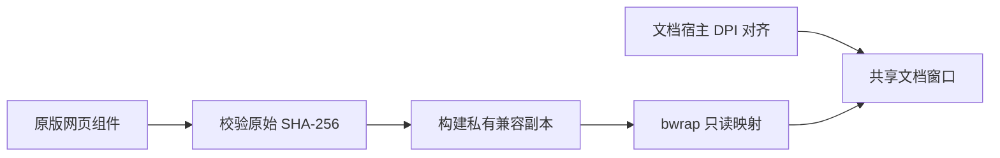

# 共享文档白屏

[返回总览](../../README.md) · [安装说明](../usage/install.md)

## 解决的问题

企业微信主窗口正常，但点击「文档」后列表和文档内容为空白。
已核验的故障环境是企业微信 `5.0.11.6018`、Wine `11.17`。

该环境中的白屏由两个问题共同引起：

1. 旧版 V8 只接受 `PAGE_READWRITE`，Wine 返回
   `PAGE_WRITECOPY` 时触发失败陷阱，网页进程随之崩溃。
2. 主窗口与 `WeMail.exe` 文档宿主的 DPI 感知模式不同，
   Wine 的跨模式 `SetParent` 拒绝嵌入窗口。

## 处理方式

本模块生成 `libcef.dll` 私有副本，移植
[V8 上游修复][v8] 的判断：允许原保护值为 `4` 或 `8`。
原来的只读保护调用、调用成功检查以及其他异常的失败陷阱都保留。

启动时，统一入口通过 `bwrap --ro-bind` 让企业微信使用私有副本。
原企业微信安装目录中的 DLL 不被覆盖。
安装时，还在选定的专用 Wine 环境中设置：

```text
HKLM\Software\Microsoft\Windows NT\CurrentVersion\
  Image File Execution Options\WeMail.exe
值名：dpiAwareness
类型：REG_DWORD
值：1
```

上面是为便于阅读而分行展示的注册表路径，第二行接在第一行之后。
本设置使文档宿主与主窗口采用相同的 DPI 感知值 `1`，
不改变系统全局 DPI。



## 构建与安装

依赖：Python 3、Wine、bubblewrap，以及已安装的对应企业微信组件。
脚本从本地 DLL 生成补丁，不需要管理员权限。

先把下面的示例路径换成企业微信专用 Wine 环境：

```bash
prefix="$HOME/.local/share/wecom/prefix"
./wecom-fix build docs --prefix "$prefix"
./wecom-fix install docs --prefix "$prefix"
./wecom-fix launch --prefix "$prefix"
```

退出该 Wine 环境中的旧企业微信及文档进程后再使用统一入口启动。
已运行的进程不会因安装文件而自动重新加载 DLL。

单独构建脚本也可使用，产物只写入指定目录：

```bash
python3 modules/docs/patch-libcef.py \
  --source /path/to/original/libcef.dll \
  --output /path/to/build/libcef.dll
```

源文件与目标文件必须不同；相同路径、符号链接、硬链接均被拒绝。
不匹配的输入不会生成输出，不能把其他版本强行套用这些偏移。

## 版本约束

支持的原始 SHA-256：

```text
007385e85fce0e70788dbc362792d0738f6a7f5a045858924ab4789fa58a369f
```

生成副本必须匹配：

```text
8f896cc2625a1c25bb8bbeaac3a4336296382eec82fdbf982485103fb9abcf79
```

这些哈希约束全部文件字节，不只约束显示出来的企业微信版本号。
更新企业微信后如果检查失败，应先移除此模块并重新诊断。

## 验证范围

2026-09-21，Wine `11.17`、企业微信 `5.0.11.6018` 环境中的
文档列表和右侧表格已恢复显示。检测结果为 `main=1`、`doc=1`，
文档根窗口属于企业微信主窗口。

上述原始 DLL 已通过离线重建校验，生成副本与指定 SHA-256 一致。
这一校验覆盖补丁字节和文件完整性；其他组件版本的界面兼容性尚未验证。

手动验收时检查文档列表、打开已有文档，以及主窗口内的嵌入行为。
「文档容量已满」属于企业管理容量限制，此模块不能解决。

## 回滚与限制

```bash
./wecom-fix remove docs --prefix "$prefix"
```

移除后退出并重启企业微信，使新进程恢复读取原 DLL。
注册表的恢复方式和冲突处理见[安装说明](../usage/install.md)。
如果自行运行过单独补丁脚本，删除它生成的私有文件即可；
不要删除企业微信安装目录中的原版 DLL。

此兼容处理不代表所有 CEF 白屏均由同一原因引起，
也不处理账号权限、网络访问或文档容量。

## 来源与许可

原组件及其中第三方代码仍分别适用其原有许可证。

[v8]: https://github.com/v8/v8/commit/df1eaa2bd84bf9cc8ff2d6b5e7ca53290546e4ab
