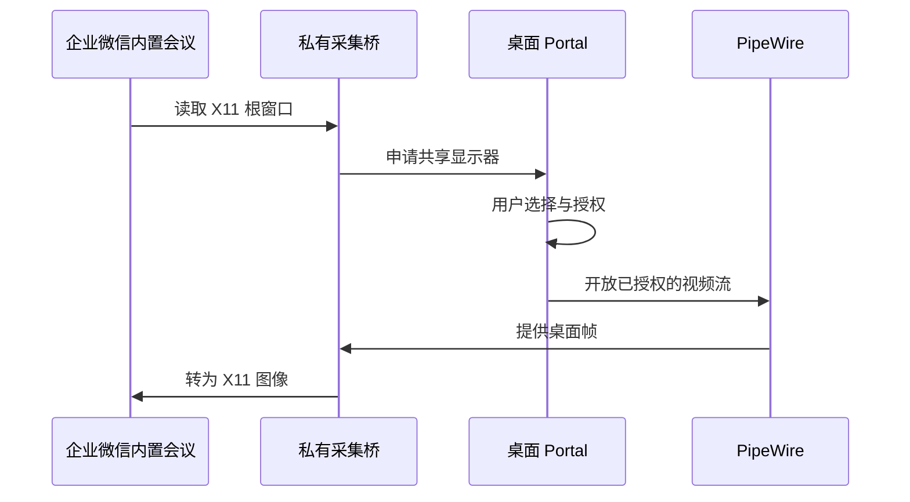

# Wayland 桌面共享

[返回总览](../../README.md) · [安装说明](../usage/install.md)

## 解决的问题

Wine/XWayland 内置会议通过 X11 读取桌面时，无法直接取得整个
Wayland 桌面的真实画面。已验证的处理方式是通过桌面 Portal
申请用户选择的显示器，再从 PipeWire 获取图像，交给会议的采集调用。

这与摄像头修复、96 DPI 会议控件修复是三个独立功能。

## 工作方式



统一入口只向企业微信进程及其子进程设置 `LD_PRELOAD`。
库内部还检查 `WECOM_SCREENSHARE=1`、进程名和会议模块路径。
只有会议宿主对 X11 根窗口的 `XGetImage`、`XCopyArea` 调用被接管，
普通窗口绘制仍调用原函数。

识别对象包括 `wwmapp.exe`，以及企业微信 `WeMeet` 目录中的
`--module=...wemeet.dll` 宿主。
不要把这个库设置成桌面会话或系统全局的 `LD_PRELOAD`。

## 依赖与构建

需要 GCC C++20、`pkg-config`、libportal、PipeWire、libX11 开发文件。
运行时需要正常的用户 D-Bus 会话、桌面 Portal 后端和 PipeWire。
Hyprland 通常使用 `xdg-desktop-portal-hyprland` 提供选择与采集能力。

```bash
prefix="$HOME/.local/share/wecom/prefix"
./wecom-fix build screencast --prefix "$prefix"
./wecom-fix install screencast --prefix "$prefix"
./wecom-fix launch --prefix "$prefix"
```

库在本地编译，产物位于指定构建目录。
不需要接触企业微信厂商 DLL，也不需要管理员权限。

## 使用与验收

1. 完全退出旧企业微信，再使用统一入口启动。
2. 进入内置会议并选择共享桌面。
3. 在桌面 Portal 弹窗中选择要共享的显示器并授权。
4. 让另一端确认可以看到画面、画面会更新且颜色正常。
5. 停止共享，确认系统共享提示消失。

本桥不请求持续授权，每个新会话仍由 Portal 决定权限。
选择弹窗超时为 60 秒；取消或关闭后不会持续重复弹窗。
停止桌面读取约 5 秒后，桥接层关闭采集会话。
重新开始共享前需要留出这个空闲间隔。

PipeWire 流报错后，采集线程置失败标记，GLib 线程关闭会话并清空画面。
持续读取期间保持阻断，避免把最后一帧无限期当成当前桌面，
也避免重复弹窗；停止共享至少 5 秒后可重新发起。

首次授权完成和第一帧到达之前可能暂时返回黑色图像。
库的 stderr 只记录启动、首帧尺寸、停止和错误状态。
桥接库本身不保存图像文件、不采集音频、不建立网络连接；
会议客户端仍会按用户操作向参会者传送画面。

## 验证范围

2026-09-21，Portal 采集已收到 `2560×1600` 首帧，
停止共享后采集会话正常关闭，另一端能看见共享画面。
对应环境为 Wine `11.17`、企业微信 `5.0.11.6018`、
内置会议 `3.26.511.637`、Hyprland `0.56.2`。

当前源码已通过 `-Wall -Wextra -Werror` 编译。
离线测试覆盖流错误后清空像素、阻断重试、空闲后解除阻断，
以及默认视觉的 24/32 位 RGB 布局和完整平面掩码要求。
这些检查不包含真实会议；当前错误恢复与视觉检查行为，
以及依赖升级后的远端共享效果，仍需按上面的步骤进行实际验收。

## 限制与排障

- 只申请显示器来源，不提供独立窗口或音频采集。
- 不实现 `SetWindowDisplayAffinity`，不能自动隐藏会议自己的窗口。
  尚不支持排除会议窗口，可能显示「无法过滤会议窗口」提示。
- 多显示器、不同缩放和旋转布局需要单独验收。
  当前实现将选定来源映射到 X11 根窗口尺寸，复杂布局可能缩放失真。
- 单帧尺寸限制为最长边 8192 像素，像素总量不超过 33554432。
- 仅接管深度为 24/32 位、RGB 掩码为 `0xff0000/0xff00/0xff`
  的默认视觉，且请求须包含全部有效颜色平面。
  其他视觉或部分平面请求交回原 X11 函数，不额外申请桌面采集。
- 仅接受可映射的四通道 RGB/BGR 内存帧，未实现 DMA-BUF 零复制。
- 捕获异常时先检查 Portal、PipeWire 和用户会话日志。
  不要通过扩大进程匹配范围来解决普通应用的共享问题。

## 回滚

```bash
./wecom-fix remove screencast --prefix "$prefix"
```

退出并重启企业微信后，库不再加载。
卸载不会关闭已经运行的会议进程；旧进程须正常退出后才会卸载其库。

## 来源与许可

动态链接库保持各自许可：libportal 使用 LGPL-3.0-only；
PipeWire 的不同组件采用 MIT 或 LGPL-2.1-or-later，
libX11 列有 MIT 与 X11 许可。以实际依赖中各文件的许可为准。

接口参见 [libportal 官方项目][portal]、[PipeWire 官方项目][pipewire]。

[portal]: https://github.com/flatpak/libportal
[pipewire]: https://gitlab.freedesktop.org/pipewire/pipewire
